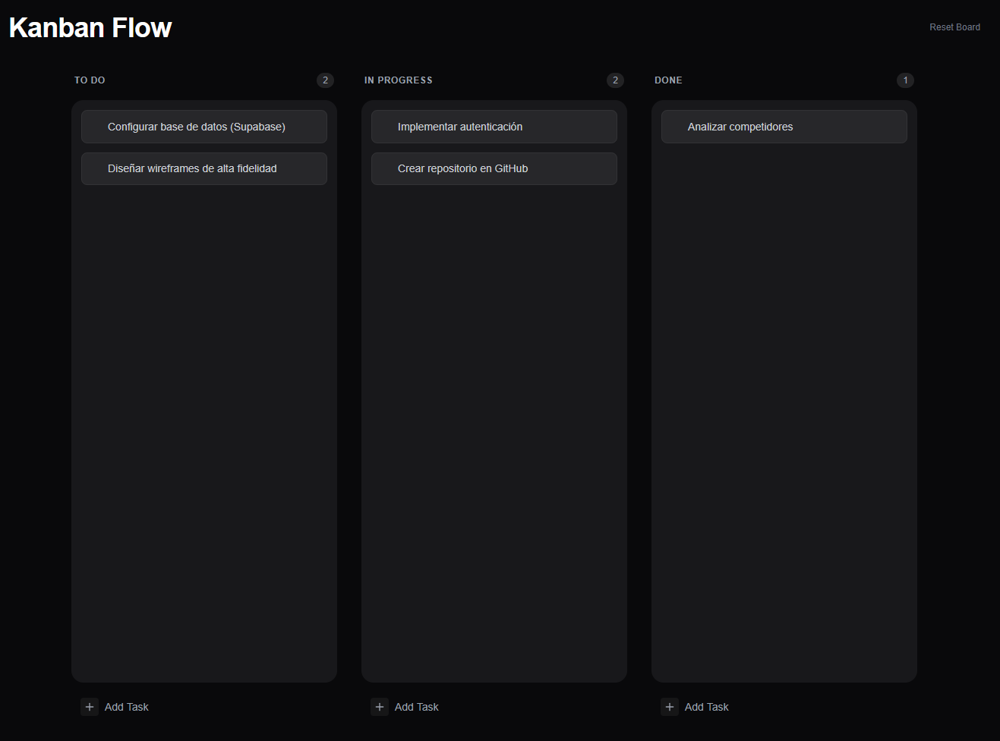

# 📋 Kanban Flow - Task Manager

A high-performance Kanban board application built with React, featuring seamless drag-and-drop functionality and local persistence. Designed to mimic professional tools like Linear or Trello.

## 🚀 Live Demo
[View Live Project](https://kanban-task-manager-eight.vercel.app/)

## ✨ Key Features
* **👆 Drag & Drop API:** Powered by `@dnd-kit` for buttery smooth interactions (sortable lists & columns).
* **💾 Local Persistence:** Tasks are saved in the browser's LocalStorage, so you never lose data on refresh.
* **⚡ Reactive State:** Instant UI updates when moving, creating, or deleting tasks.
* **🎨 Modern UI:** Clean, dark-themed interface built with Tailwind CSS.
* **📱 Smart Columns:** Auto-detection of empty columns for drop zones.

## 🛠️ Tech Stack
* React + Vite
* Tailwind CSS
* @dnd-kit (Core & Sortable)
* Lucide React (Icons)
* UUID (Unique ID generation)

---
Made with ❤️ by [Carlos Gordillo](https://github.com/c26200)
